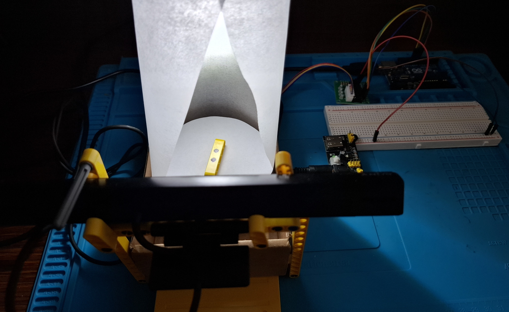
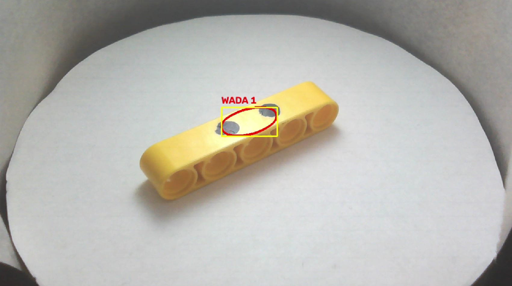

# Automated-Optical-Inspection-AOI-System-with-Edge-AI
A hardware-in-the-loop Automated Optical Inspection (AOI) system integrating machine control with Artificial Intelligence. This project utilizes unsupervised learning to detect unknown surface anomalies on industrial components in real-time.

## Setup
 

## Demo
https://youtu.be/S1hS6DVBeL4

## Reject
 

---

## System Architecture & Tech Stack

The project consists of two tightly synchronized layers operating in a Master-Slave configuration.

| Layer | Responsibilities | Technologies Used |
| :--- | :--- | :--- |
| **Hardware (Slave)** | Precise component positioning in 8 distinct steps (45-degree increments). | Arduino, Stepper Motor, C++ |
| **Software (Master)** | Live video stream, serial communication, deep learning inference, and UI. | Python 3.10+, PyTorch, OpenCV, PySerial |
| **Edge AI** | Unsupervised defect detection via feature space deviation. | Anomalib (PatchCore Model), TorchScript |

---

## Core Engineering Features

* **Unsupervised Learning:** The model was trained exclusively on "good" reference images, eliminating the need to manually label thousands of defective samples.
* **Hardware-Software Handshake:** The system fully mitigates motion blur. The Python script waits for a `PICTURE_READY` signal via the serial port, ensuring mechanical stabilization before capturing the frame.
* **Hardware Buffer Flush:** Continuous frame reading combined with `cv2.waitKey(1)` prevents UI freezing and guarantees that the AI processes only the sharpest, most recent frame.
* **Secure Edge Deployment:** Utilizes optimized TorchScript graphs (`.pt`) instead of heavy training checkpoints (`.ckpt`), implementing `TRUST_REMOTE_CODE=1` to comply with strict PyTorch 2.6+ security policies.
* **Graceful Hardware Shutdown:** The main loop relies on `try...finally` blocks to guarantee the strict release of COM ports and camera drivers (DirectShow), preventing OS-level hardware locks during unexpected terminations.

---

## Computer Vision Pipeline

Raw anomaly map tensors are processed through a custom filtering pipeline to eliminate false positives caused by natural light refraction on component edges:

1.  **Tensor Normalization:** Raw outputs are normalized to a standard 0-255 scale.
2.  **Dynamic Thresholding:** Applied at 85% of maximum intensity to separate hard defects from Edge Bias.
3.  **Geometric Filtering:** Contour area analysis rejects micro-noise (< 20px) and global lighting failures (> 30% of the frame area).
4.  **Bounding Box Generation:** Precise contours and bounding boxes are rendered directly on the original high-resolution frame.

> **System Verdict:** The system analyzes 8 captures per 360° cycle. If the anomaly score on any frame exceeds the dynamic threshold, the entire cycle is immediately flagged as rejected, simulating a strict real-world industrial sorting mechanism.

---

## Installation & Setup

**1. Hardware Prerequisites**
* A USB camera connected to the host machine (assigned to `ID_KAMERY = 1` in `detection_main.py`).
* An Arduino running a firmware that accepts the `N` (Next) command and returns `PICTURE_READY` upon completing the movement.

**2. Python Environment**
It is recommended to use a virtual environment:
```bash
pip install torch torchvision
pip install anomalib opencv-python numpy pyserial

**3. Model File Structure**
Ensure that the exported TorchScript model weights are placed exactly in this directory structure:
`gotowy_model/weights/torch/model.pt`

**4. Execution**
Verify the `PORT_COM` variable in `detection_main.py`, ensure the Arduino IDE Serial Monitor is completely closed to avoid port blocking, and run:

```bash
python detection_main.py
```

---

## 🎮 Operation & Controls

Upon launch, the script establishes hardware communication and enters a standby state awaiting user input.

* **[SPACE]** - Initiates a full 360-degree inspection cycle (8 steps).
* **[Q]** - Safely terminates the system and releases hardware ports.
